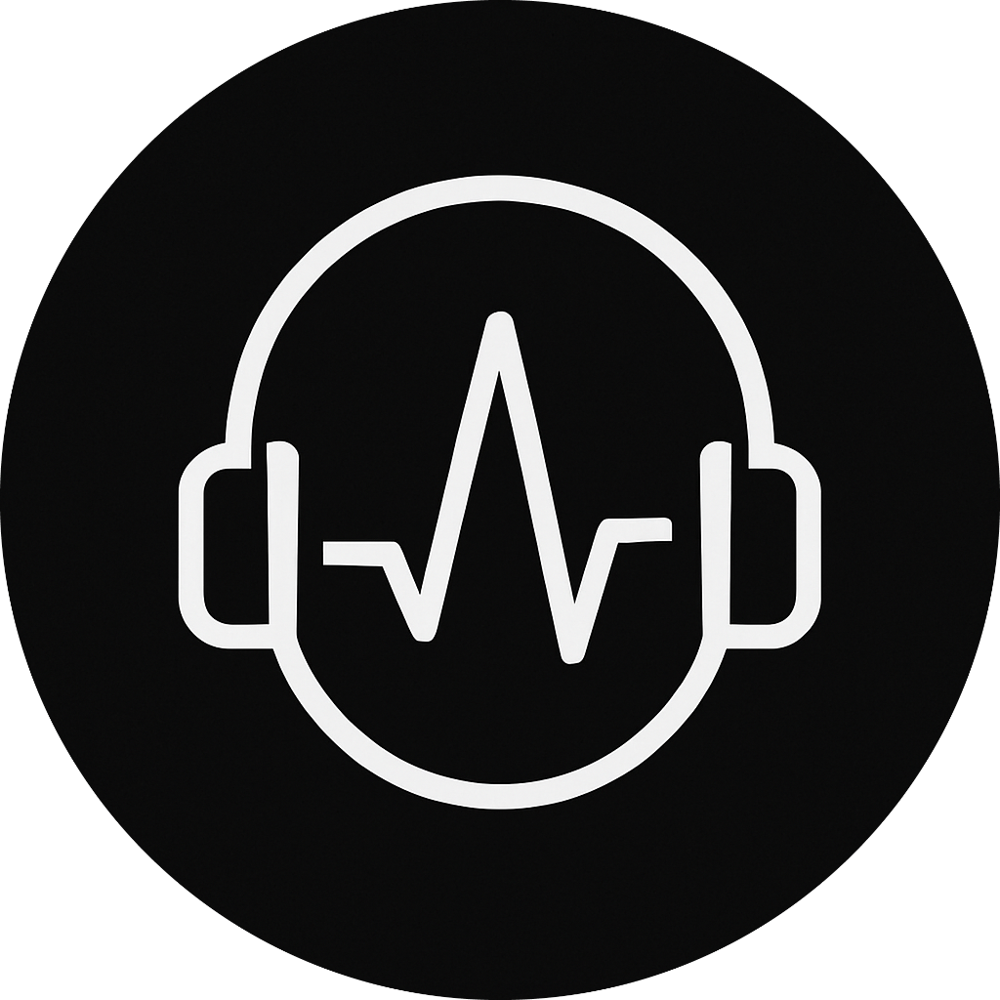
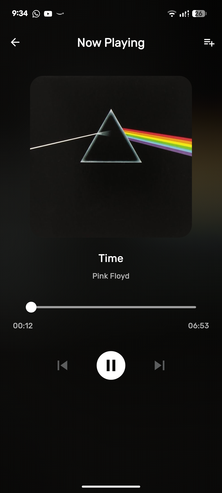
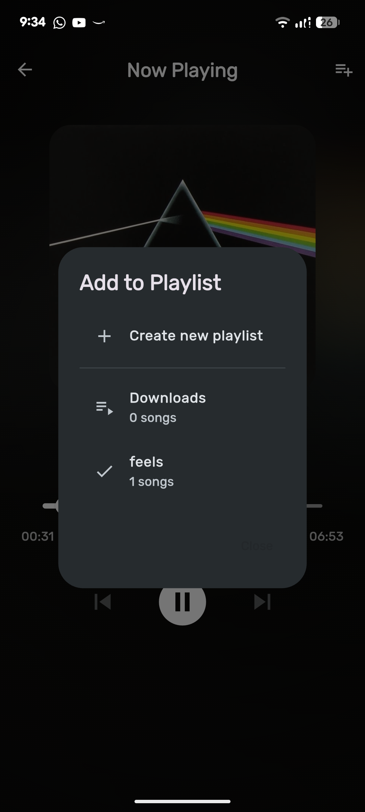
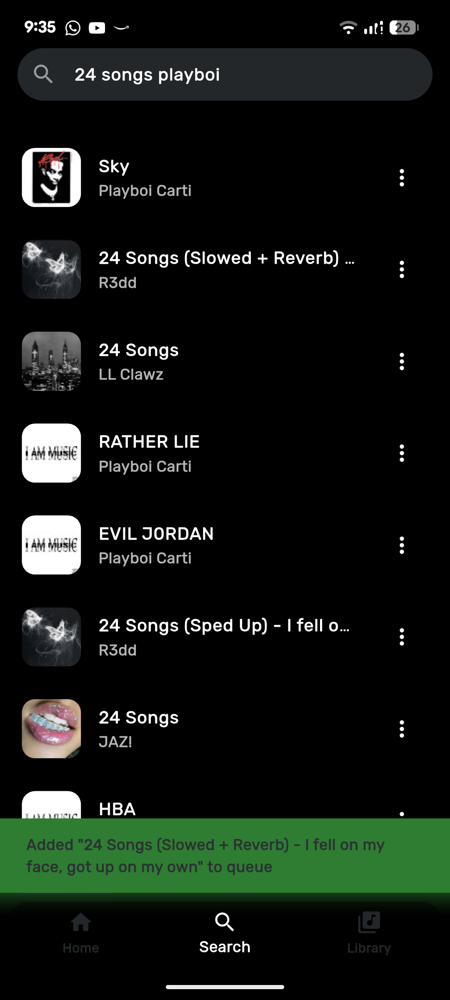
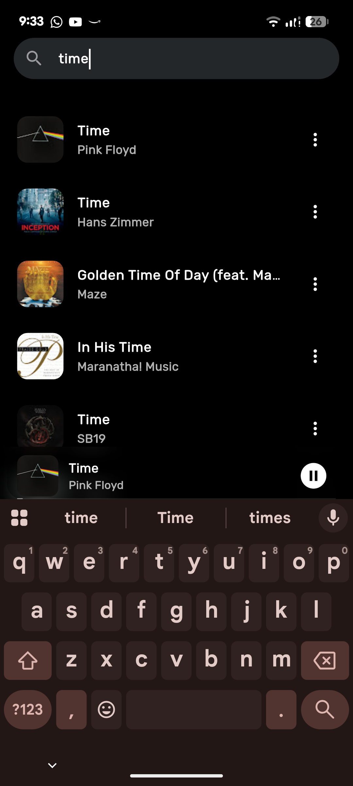

<div align="center">
  
  <h1>Musik</h1>
  <p>A Flutter-powered music player crafted with ❤️ as a learning journey</p>
</div>

## 🎵 About The Project

This project was born out of my college journey to learn modern app development. Musik is not just another music player - it's a testament to learning, growing, and understanding the intricacies of cross-platform development using Flutter.

### 📱 App Showcase

<div align="center">
  
  
  
</div>
<div align="center">
  
  
  
</div>

## 🚀 Features

- 🎨 Modern and intuitive UI design
- 🎧 Seamless audio playback
- 📱 Cross-platform compatibility
- 📂 Local music library management
- ▶️ Background audio playback

## ⚙️ Prerequisites

Before running this project, ensure you have the following installed:

- **Flutter SDK** (version 3.7.2 or higher)
- **Dart SDK** (included with Flutter)
- **Android Studio** / **VS Code** with Flutter extensions
- **Git** (for cloning the repository)

### Installation

1. **Install Flutter**
   ```bash
   # Download Flutter from https://flutter.dev/docs/get-started/install
   # Follow the installation guide for your operating system
   
   # Verify installation
   flutter doctor
   ```

2. **Clone the Repository**
   ```bash
   git clone https://github.com/your-username/musik.git
   cd musik
   ```

3. **Install Dependencies**
   ```bash
   flutter pub get
   ```

4. **Verify Setup**
   ```bash
   flutter doctor
   flutter devices
   ```

## 🏃‍♂️ Running the Project

### For Development

1. **Run on Connected Device**
   ```bash
   # Check available devices
   flutter devices
   
   # Run on specific device (replace with your device ID)
   flutter run -d <device-id>
   
   # Or simply run (Flutter will auto-detect)
   flutter run
   ```

2. **Run on Different Platforms**
   ```bash
   # Android
   flutter run -d android
   
   # iOS (macOS only)
   flutter run -d ios
   
   # Web
   flutter run -d web-server --web-port=8080
   
   # Windows
   flutter run -d windows
   
   # Linux
   flutter run -d linux
   
   # macOS
   flutter run -d macos
   ```

### For Testing

```bash
# Run all tests
flutter test

# Run tests with coverage
flutter test --coverage
```

### For Building

```bash
# Build APK for Android
flutter build apk --release

# Build App Bundle for Android (recommended for Play Store)
flutter build appbundle --release

# Build iOS (macOS only)
flutter build ios --release

# Build web application
flutter build web --release

# Build Windows executable
flutter build windows --release

# Build Linux executable
flutter build linux --release

# Build macOS application
flutter build macos --release
```

## 🔧 Development Setup

### VS Code Configuration

1. Install the **Flutter** and **Dart** extensions
2. Open the project folder in VS Code
3. Press `F5` or use the "Run > Start Debugging" menu

### Android Studio Configuration

1. Open Android Studio
2. Choose "Open an existing project"
3. Navigate to the `musik` folder
4. Wait for the project to sync
5. Use the run button (▶️) to launch the app

### Platform-Specific Setup

#### Android
- Enable **Developer options** on your device
- Enable **USB debugging**
- For emulator: Create an AVD with Android 5.0+ API level

#### iOS (macOS only)
- Install Xcode from the App Store
- Run `sudo xcode-select --install` if needed
- Accept Xcode license: `sudo xcodebuild -license accept`

#### Web
- Chrome browser recommended for development
- For deployment, ensure your server supports HTTPS for audio playback

#### Desktop
- **Windows**: Visual Studio 2019 or later with "Desktop development with C++"
- **Linux**: GTK 3 development libraries
- **macOS**: Xcode command line tools

## 🐛 Troubleshooting

### Common Issues

1. **"flutter command not found"**
   - Add Flutter to your PATH environment variable
   - Restart your terminal/command prompt

2. **"Unable to locate Android SDK"**
   - Install Android Studio
   - Set `ANDROID_HOME` environment variable
   - Run `flutter doctor --android-licenses`

3. **"Gradle build failed"**
   - Clean the project: `flutter clean`
   - Re-fetch dependencies: `flutter pub get`
   - Try running again: `flutter run`

4. **Audio playback issues**
   - Ensure internet connection is stable
   - Check if YouTube is accessible in your region
   - Try with VPN if YouTube is restricted

5. **Emulator performance issues**
   - Enable hardware acceleration in BIOS
   - Increase RAM allocation to emulator
   - Use x86_64 images instead of ARM

### Getting Help

- Check `flutter doctor` for environment issues
- Review the official [Flutter documentation](https://flutter.dev/docs)
- Open an issue on the project repository

## 🛠️ Built With

- Flutter - UI Framework
- just_audio - Audio playback
- Provider - State Management
- SQLite - Local Database

## 📖 Learning Outcomes

Through this project, I gained hands-on experience with:
- State Management in Flutter
- Platform-specific implementations
- Audio handling in mobile applications
- UI/UX design principles
- Database management
- Version control with Git

## 🎓 Academic Context

This project was developed as part of my coursework in mobile application development. It represents my journey from conceptualization to deployment, incorporating best practices and modern development patterns.

## 🤝 Acknowledgments

- The Flutter community for their invaluable resources.
- my cat.

## 📝 Note

This project serves as a learning milestone in my software development journey. While it may not be perfect, every line of code represents a lesson learned and a skill gained.

---
<div align="center">
  Made with 💻 and lots of ☕
</div>